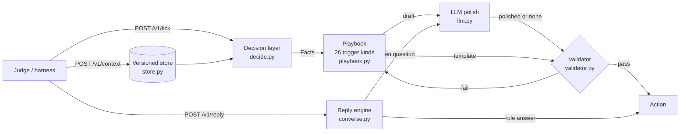

# Vera Message Engine

**magicpin AI Challenge — "Build Vera Better" · Solo entry by Shrey Gupta**

A FastAPI service that decides **whether**, **to whom** and **what** Vera should send on WhatsApp, writes a message grounded only in the context it was given, and then handles the conversation that follows. It runs entirely on free-tier infrastructure.

| | |
|---|---|
| **Live endpoint** | `https://vera-bot-d58c.onrender.com` |
| **Submitted build** | `b4ca50f` on `main` (frozen; auto-deploy is off) |
| **Stack** | Python 3.11+, FastAPI, httpx · Gemini (primary) + Groq (failover), both free tier · Render free web service |
| **Contact** | shreygupta0924@gmail.com |

---

## Contents
1. [Design in one line](#1-design-in-one-line)
2. [Architecture](#2-architecture)
3. [How a message is made](#3-how-a-message-is-made-v1tick)
4. [How a reply is handled](#4-how-a-reply-is-handled-v1reply)
5. [Guarantees](#5-guarantees)
6. [Results](#6-results)
7. [Trade-offs and limitations](#7-trade-offs-and-limitations)
8. [Repository layout](#8-repository-layout)
9. [Run, test, deploy](#9-run-test-deploy)

---

## 1. Design in one line

> **Rules decide, templates write, the LLM only polishes, and a validator has the last word.**

The hard part of this challenge is making the right call on thin or contradictory data **without inventing anything**, and doing it within free-tier LLM quotas (about 10–30 requests a minute) while a tick can ask for 20 messages at once. So every decision is deterministic and every message has a grounded template version that is always valid. The LLM is an optional fluency layer that can never add a fact, and if its output fails a check, the template is sent instead.

---

## 2. Architecture



| Layer | File | Responsibility |
|---|---|---|
| API | `app/main.py` | The 5 required endpoints, deadlines, per-tick selection, background pre-composition |
| Store | `app/store.py` | Versioned context (`200` / `409 stale_version` / `400`), conversations, merchant state, output cache |
| Facts | `app/facts.py` | One typed view over the 4 context layers: names, language, performance vs. benchmark, offers, dates, and the set of **allowed numbers** |
| Decision | `app/decide.py` | Skip / send: suppression, opt-out, category × kind compatibility, consent, ranking |
| Playbook | `app/playbook.py` | One composer per trigger kind; claim verification and honest pivots |
| Validator | `app/validator.py` | Final gate on every outgoing message |
| LLM | `app/llm.py` | Gemini → Groq failover behind per-provider token buckets and cooldowns |
| Conversation | `app/converse.py` | Rule-first intent classifier and a small state machine for multi-turn replies |

More detail, including every trigger kind and the conversation state machine, is in [`docs/ARCHITECTURE.md`](docs/ARCHITECTURE.md).

---

## 3. How a message is made (`/v1/tick`)

1. **Plan every available trigger** (`decide.plan_trigger`). A trigger is skipped, with a stated reason, when:
   - its suppression key was already used, or the merchant opted out or was hostile;
   - the needed context isn't loaded yet (retried on the next tick);
   - the trigger kind doesn't fit the category (e.g. no chronic-refill reminder from a dentist, no IPL promo for a gym);
   - a customer message has no consent (`consent.scope` or `reminder_opt_in`).
2. **Verify the claim.** A trigger's label is treated as a claim, not a fact. A `perf_dip` whose numbers show +8% is **not** called a dip; the bot pivots to the strongest real signal (expired plan, unverified Google profile, upcoming renewal, click-rate gap against the category benchmark) and says what it checked.
3. **Compose** with the playbook: anchor facts, one persuasion lever, one call to action, and a ready "next action" artifact (e.g. the exact Google post it will publish), in the merchant's or customer's language (English / Hinglish).
4. **Polish** (optional): the LLM rewrites the draft for fluency. The result is rejected unless it keeps every number in the draft, keeps the same reply keyword, stays within length, and uses Vera's feminine Hindi forms.
5. **Validate** the final text; on any failure the template draft is used.
6. **Select**: rank by urgency and value, send at most one new conversation per merchant and per customer per tick, defer low-urgency nudges to a merchant who is mid-conversation, cap at 20 actions.

Composition starts in the background as soon as a trigger arrives on `/v1/context`, so most ticks just serve cached, already-validated messages.

---

## 4. How a reply is handled (`/v1/reply`)

Replies are classified by rules first (English, Hindi and Hinglish lexicons); the LLM is used only to answer genuine open questions.

| Merchant says | Vera does |
|---|---|
| Auto-reply ("Thank you for contacting us…") | Detected by phrase and by a per-merchant fingerprint: one gentle nudge, then wait, then end |
| "Yes / haan kar do / let's do it" | Delivers the drafted artifact immediately. No more qualifying questions |
| A question | Grounded answer from known facts; says honestly when a number isn't available |
| "How many people saw my post?" | Only whole-listing numbers exist, so it says that and gives them with their correct label |
| "Busy, later / kal" | Waits (hours or a week, depending on the wording) |
| Stop / not interested | Ends and never messages again |
| Hostile | One-line apology, then ends |
| Off-topic (GST, loans…) | Polite decline and a redirect to the pending action |
| Customer picks a slot ("2") | Confirms the exact slot |

---

## 5. Guarantees

These are enforced in code, not left to the prompt:

- **No invented numbers.** Every number in an outgoing message must appear in the context or be derived from it (differences, day counts, percentages). Benchmarks are labelled as the magicpin category benchmark.
- **No invented offers.** Catalog formats are framed as suggestions ("a common format for clinics"), never as the merchant's live offer.
- **No URLs** unless present in the context; no taboo words or internal jargon; exactly one clear call to action; no verbatim repeats within a conversation.
- **No mislabelled metrics.** An LLM answer that ties whole-listing views or calls to a single post or offer is rejected.
- **Always answers within the deadline.** Tick budget 10 s, reply budget 8 s, 6 s per LLM call; templates are the fallback when quota or time runs out.
- **Deterministic.** The same inputs give the same template output, and the first message served for an input is cached and reused.

---

## 6. Results

Measured locally with the starter pack's own judge (`judge_simulator.LLMScorer`) on the canonical 30 test pairs:

| Run | Specificity | Category fit | Merchant fit | Decision | Engagement | **Total / 50** |
|---|---|---|---|---|---|---|
| First complete build | – | – | – | – | – | 35.2 |
| After tuning (submitted logic) | 7.6 | 8.1 | 8.7 | 7.5 | 7.3 | **39.2** |
| Repeat run, same build | 7.4 | 8.1 | 8.4 | 7.5 | 7.3 | 38.7 |

- One of the 30 pairs (T08, a refill reminder that doesn't apply) is deliberately **not** sent; the bot chooses restraint.
- The judge varies by about ±2 per message between runs, so only differences of 1 or more on the total are treated as real.
- Contract tests: 6/6. Replay drills (auto-reply, intent change, hostile then off-topic, opt-out, curveball then "later", customer slot pick, unknown conversation): 7/7 locally and against the live URL. Injection, latency (20 triggers in one tick) and determinism drills pass.

**Tried and not shipped.** The `improve-engagement` branch anchored customer messages on visit history. It scored 38.0 because the judge can't see that history and read it as invented, so it was measured and deliberately not merged.

---

## 7. Trade-offs and limitations

- **Templates before LLM.** Free quotas can't support 20 LLM compositions per tick, so the template path must be good on its own. The cost is plainer wording when the LLM is unavailable.
- **Narrow restraint.** The bot skips only clear violations; anything else is sent, because a message that isn't sent can't help the merchant.
- **In-memory state.** The free host has no persistent disk, so a platform restart empties the store. A `=== BOOT ===` log marker makes restarts visible, and a one-minute keep-alive ping stops the free instance from sleeping.
- **Thin trigger payloads.** Many generated triggers are placeholders (no festival date, competitor details or appointment time). The bot falls back to real merchant facts rather than guessing.

**Context that would help most:** per-trigger event details, post-level performance, review counts and open booking slots.

---

## 8. Repository layout

```
app/
  main.py        FastAPI app: endpoints, deadlines, tick selection, pre-composition
  store.py       versioned context store, conversations, merchant state, cache
  facts.py       typed view over category / merchant / customer / trigger + allowed numbers
  decide.py      skip rules, consent, category compatibility, ranking
  playbook.py    composers for all 26 trigger kinds, claim checks, honest pivots
  validator.py   final gate on every outgoing message
  llm.py         Gemini + Groq clients, rate limiters, polish and answer prompts
  converse.py    reply classifier and conversation state machine
  util.py        dates, Indian number formatting, number extraction
eval/
  canonical30.py judged run on the 30 canonical pairs (writes results/submission.jsonl)
  drills.py      replay, injection, latency and determinism drills (local or --url)
  harness.py     mini 60-minute harness with LLM-played merchants and a flow judge
  llm_check.py   checks which models your keys can use
tests/
  test_contract.py  endpoint contract tests
docs/
  ARCHITECTURE.md   detailed design
  BUILD_PLAN.md     the plan this was built from
render.yaml      Render blueprint (free plan, health check, auto-deploy off)
```

---

## 9. Run, test, deploy

```bash
pip install -r requirements.txt
cp .env.example .env                 # add your own keys; .env is git-ignored
uvicorn app.main:app --port 8080     # set LLM_ENABLED=0 to run on templates only

python -m pytest -q                  # contract tests
python eval/llm_check.py             # which models your keys can use
python eval/drills.py replay         # conversation drills (add --url for a deployed bot)
python eval/canonical30.py --judge   # judged run (needs the starter pack in starter/)
```

**Deploy:** create a Render free web service from `render.yaml`, set `GEMINI_API_KEY` and `GROQ_API_KEY` as environment variables, and add a one-minute external ping to `/v1/healthz`.

**Endpoints:** `POST /v1/context`, `POST /v1/tick`, `POST /v1/reply`, `GET /v1/healthz`, `GET /v1/metadata` (plus `POST /v1/teardown` for test resets).
