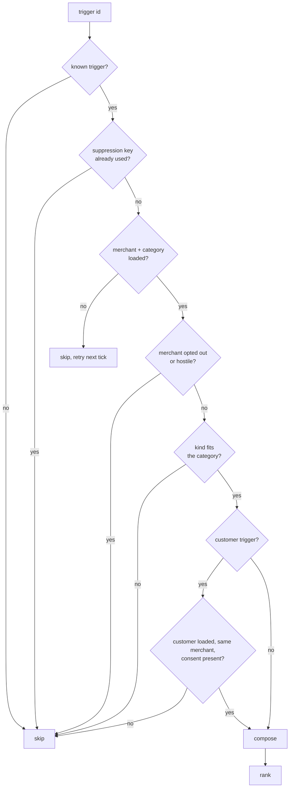
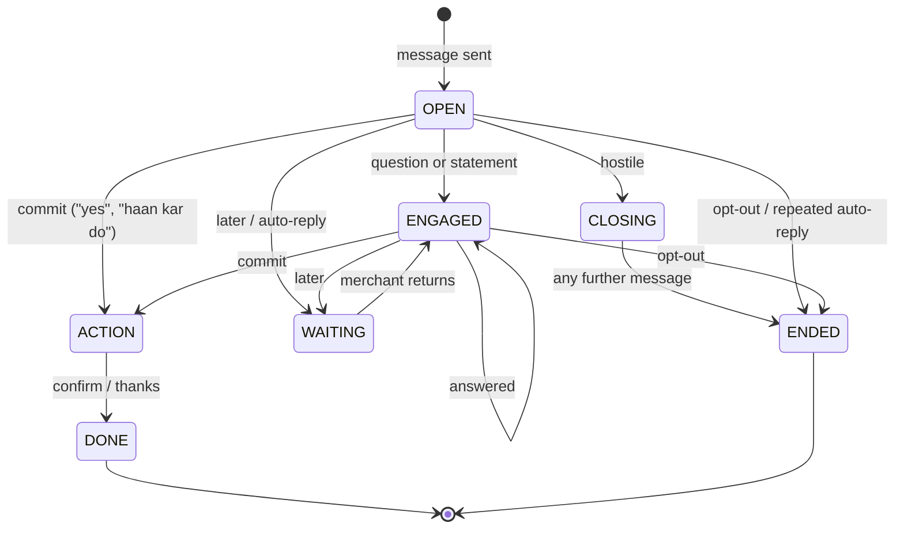

# Architecture

This document goes one level deeper than the [README](../README.md): the data model, the decision rules, how each trigger kind is handled, the conversation state machine, and how the service stays inside free-tier limits.

---

## 1. Principles

1. **Grounded or silent.** A fact that isn't in the context, or can't be computed from it, never reaches a message.
2. **Decisions are code, not prompts.** Whether to send, to whom, and with which call to action is decided by deterministic rules that can be read and tested.
3. **The LLM is optional.** Every message has a template version that is valid on its own; the LLM can only make it read better.
4. **One message, one job.** Each message has one reason to exist now, one persuasion lever, and one low-effort call to action, with the work already prepared ("Reply YES and I'll publish this post").
5. **Honest pivots.** When a trigger's label disagrees with the data, the bot says what it checked and pivots to the strongest real signal, instead of repeating the label.

---

## 2. Data model

`POST /v1/context` stores four scopes: **category**, **merchant**, **customer** and **trigger**. Each is keyed by `(scope, id)` and versioned:

| Case | Response |
|---|---|
| New id, or a higher version | `200`, payload replaced |
| Same or lower version | `409 stale_version` |
| Malformed body | `400` |

`Facts` (`app/facts.py`) is built per trigger and is the only thing composers read. It gives:
- **Identity and voice:** salutation (e.g. "Dr." for dentists), business name, locality, merchant and customer language (English or Hinglish).
- **Performance:** views, calls, click-through rate, 7-day deltas, and the gap to the category benchmark.
- **Offers:** the merchant's live offers first; catalog formats only as clearly framed suggestions.
- **Category knowledge:** fresh digest items (never repeating one already used), seasonal beats, upcoming festivals.
- **Allowed numbers:** every number found in the four context layers, plus any number a composer derives (day counts, differences). The validator checks each outgoing message against this set.

---

## 3. Decision layer (`app/decide.py`)

For each trigger in `available_triggers`:

**Category compatibility** (kinds that are skipped for a category):

| Kind | Not sent by |
|---|---|
| `chronic_refill_due` | dentists, salons, restaurants, gyms |
| `recall_due` | pharmacies, restaurants |
| `trial_followup` | pharmacies, restaurants |
| `ipl_match_today` | dentists, salons, gyms, pharmacies |
| `wedding_package_followup` | restaurants, pharmacies |

**Ranking** = 3 × urgency + evidence strength (how many verified numbers the draft carries) + a small bonus for freshly updated merchant context − a small penalty for pivots and open-ended asks.

**Selection per tick:** highest score first, one new conversation per merchant and per customer, low-urgency nudges deferred while the merchant is mid-conversation, at most 20 actions.

---

## 4. Playbook (`app/playbook.py`)

Every composer returns either a `Draft` (body, call-to-action type, lever, rationale, next-action artifact) or a `Skip` with a reason.

| Group | Kinds | What the message does |
|---|---|---|
| Knowledge | `research_digest`, `regulation_change`, `cde_opportunity`, `supply_alert` | Cites the source and date, states the one practical action, offers to prepare it (checklist, registration, notice) |
| Seasonal / events | `category_seasonal`, `festival_upcoming`, `ipl_match_today` | Uses real dates and category data; pairs with a live offer; IPL logic is contrarian when the data says match nights are weak for dine-in |
| Performance | `perf_dip`, `perf_spike`, `seasonal_perf_dip`, `milestone_reached` | Verifies the claim first (a dip must be at least −10%, a spike at least +15%); otherwise pivots honestly |
| Relationship | `dormant_with_vera`, `curious_ask_due`, `active_planning_intent`, `review_theme_emerged` | A short, specific question or a ready first draft of what the merchant asked about |
| Account | `renewal_due`, `winback_eligible`, `gbp_unverified` | States the concrete loss (expired plan, unverified profile) and the steps to fix it |
| Competition | `competitor_opened` | Real distance and prices when present; otherwise frames the risk against the merchant's own traffic |
| Customer (sent as the merchant) | `recall_due`, `appointment_tomorrow`, `chronic_refill_due`, `trial_followup`, `customer_lapsed_soft`, `customer_lapsed_hard`, `winback_customer`, `wedding_package_followup` | Uses the customer's name and language, real slots, the merchant's own offers only, and a reply-with-a-number or YES call to action |

Unknown kinds go through a generic composer that builds a safe, grounded message from the merchant's own numbers.

**Visible anchors.** Every merchant message carries at least two numbers the reader can check (e.g. profile views and calls for the last 30 days). If a draft has fewer, an anchor sentence is added that states them as the reason for the action.

---

## 5. Validator (`app/validator.py`)

The last gate before any message leaves the service. A message fails if it has:
- a number not in the allowed set;
- a URL not present in the context;
- a category taboo word, internal jargon or a snake_case identifier;
- more than one call to action, or an open-ended question dressed as a yes/no;
- "Vera" in a message sent as the merchant to a customer;
- an exact repeat of an earlier message in the same conversation.

The LLM's output is validated too. On any failure the template draft is used; the template itself is designed to always pass.

---

## 6. LLM layer (`app/llm.py`)

| | Gemini (primary) | Groq (failover) |
|---|---|---|
| Model | `gemini-3.5-flash-lite` | `openai/gpt-oss-20b` |
| Budget (set about 20% under free limits) | 8 RPM · 200k TPM · 400 RPD | 24 RPM · 6.4k TPM · 800 RPD |

- A token bucket per provider tracks requests per minute, tokens per minute and requests per day. A `429` or `503` puts that provider on a 60-second cooldown.
- Each call has a 6 s timeout inside the endpoint deadline (tick 10 s, reply 8 s).
- **Polish** is accepted only if the draft's numbers are a subset of the output's, the length is at most 1.25× + 60 characters, the reply keyword is unchanged, and no masculine Hindi verb forms appear for Vera.
- **Answers** to open questions get labelled facts ("whole Google listing, last 30 days: profile views X…"). A guard rejects any answer that ties a listing-level number to a single post, offer or campaign.
- Composition starts in the background when a trigger is pushed; only successful polishes are cached, so a later tick with fresh quota can still improve a message.

---

## 7. Conversation engine (`app/converse.py`)

**Intent classification** is rule-based, in priority order:

`auto_reply → opt_out → hostile → decline → off_topic → who_are_you → later → choice → commit → thanks → question → open`

**State machine:**

- **Auto-replies:** detected by phrase (English, Hindi, Hinglish) and by a fingerprint of each merchant's canned text. The first one gets one short nudge, the second a wait, the third ends the conversation.
- **Commitment:** the prepared artifact (post text, checklist, booking) is delivered in the same turn. No further qualifying questions.
- **Language:** each reply mirrors the language of the merchant's latest message.
- **No repeats:** a reply that would repeat an earlier message word for word turns into a wait instead.
- Replies for unknown conversation ids are handled by rebuilding context from the merchant record, so the simulator's style of calls works.

---

## 8. Operations

- **Hosting:** Render free web service (Singapore), one worker, health check on `/v1/healthz`, auto-deploy off so the submitted build cannot change.
- **Keep-alive:** an external ping every minute, so the free instance never sleeps (sleeping would wipe the in-memory state).
- **Observability:** a `=== BOOT ===` log line on every start; `/v1/healthz` reports uptime and context counts; `/v1/metadata` reports the team and the models in use.
- **Secrets:** API keys live only in Render environment variables and a local, git-ignored `.env`.

---

## 9. Testing

| Check | Command | Covers |
|---|---|---|
| Contract | `python -m pytest -q` | Health and metadata, context versioning (`409`), tick shape and suppression, dip-claim pivot, reply flows, teardown |
| Judged run | `python eval/canonical30.py --judge` | The 30 canonical pairs scored by the starter judge; also re-validates every message |
| Replay | `python eval/drills.py replay` | Auto-reply loop, intent change, hostile then off-topic, opt-out, curveball then later, slot pick, unknown conversation |
| Injection | `python eval/drills.py inject` | New digest item and performance change show up in the next message |
| Latency / determinism | `python eval/drills.py latency` / `determinism` | 20 triggers in one tick; identical output for identical input |
| Harness | `python eval/harness.py` | 8 ticks with injections; LLM-played merchant personas; a flow judge per conversation |

All eval scripts accept `--url` to run against a deployed bot.
